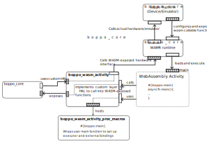
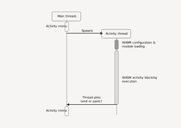
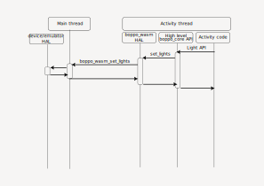
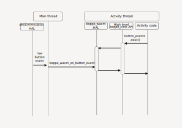

# Boppo Webassembly Activity Framework for Rust

This repository contains the Rust framework for creating local Webassembly activities using Rust.

In development

## Initial architecture diagram

### High-level main activity execution sequence

### Light setting sequence

### Button events sequence

## Key design questions remaining

1. AOT compilation of wasm modules would probably be beneficial for activities (read from flash, not copied to RAM); but this requires a compatible Wamr version to compile the wasm file -- an extra step. Wouldn't it be interesting, for "third party activity developers" developer experience, to provide the build step as a web service on the boppo activity developer portal (or whatever it ends up being named ;) ) ? This way they can compile to wasm and we do the final AOT step. We can keep interpreter mode for development or fallback, but AOT seems interesting on embedded devices -- limited resources and all.

## Findings for later

### Integration of Wamr

WAMR has an [officially supported component](https://components.espressif.com/components/espressif/wasm-micro-runtime/versions/2.4.0~1/readme) for esp.

The wamr-rust-sdk can use it directly by using the "esp-idf" feature flag, and fall back to building it from source on desktop.
